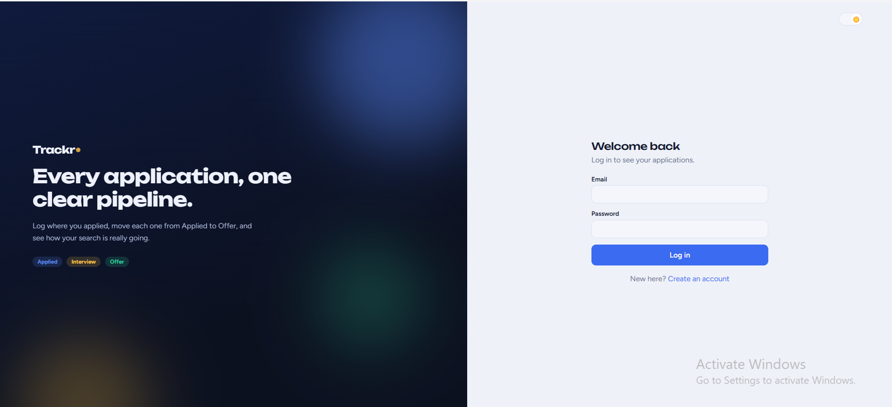
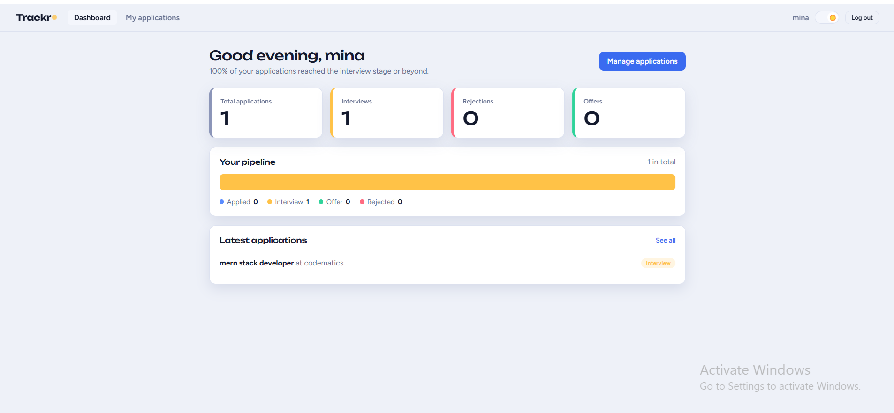
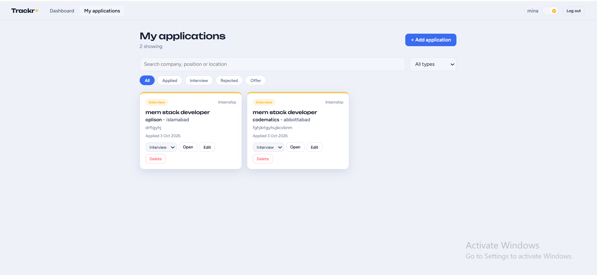
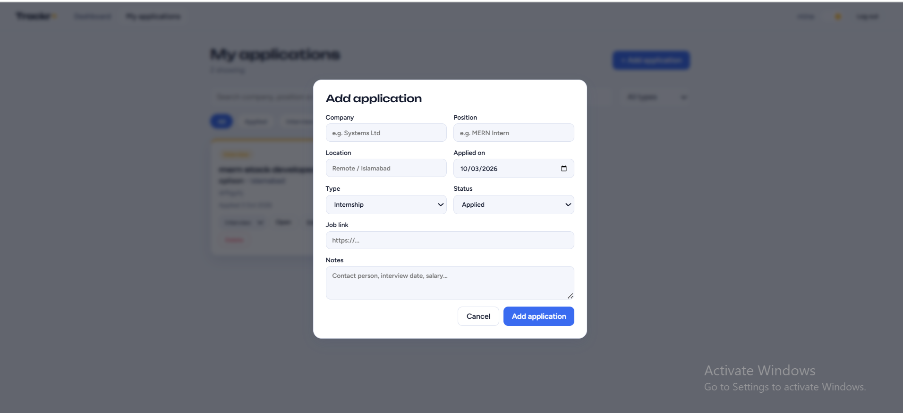

# Trackr - Job & Internship Tracker

A full-stack **MERN** application that helps students and job seekers keep every application in one clear pipeline: log where you applied, move each one from **Applied** to **Offer**, and see how your search is really going.

## Live Demo

- **Frontend:** https://mern-final-project-day-21-28-phiq.vercel.app
- **Backend API:** https://mern-final-project-day-21-28.vercel.app

## Screenshots

| Login | Dashboard |
|---|---|
|  |  |

| My Applications | Add / Edit Application |
|---|---|
|  |  |

## Features

- User registration, login and logout with **JWT authentication**
- Passwords hashed with **bcrypt**
- Protected routes on both frontend and backend
- Add, view, edit and delete applications (company, position, location, type, status, date, link, notes)
- Statuses: **Applied, Interview, Rejected, Offer**; types: **Job, Internship**
- Search by company, position or location
- Filter by status and by type
- Dashboard with animated statistics and recent applications
- Dark and light theme
- Each user sees only their own data

## Tech Stack

| Layer | Technologies |
|---|---|
| Frontend | React 18, Vite, React Router, Context API |
| Backend | Node.js, Express, JSON Web Token, bcryptjs, CORS |
| Database | MongoDB Atlas, Mongoose |
| Deployment | Vercel (frontend and backend), GitHub |

## Project Structure

```
job-tracker/
├── client/                 React (Vite) frontend
│   ├── src/
│   │   ├── api.js          fetch wrapper, adds JWT token
│   │   ├── App.jsx         routes
│   │   ├── components/     Navbar, JobModal, ProtectedRoute, ThemeToggle
│   │   ├── context/        AuthContext, ThemeContext
│   │   └── pages/          Auth, Dashboard, Jobs
│   └── vercel.json
└── server/                 Express API
    ├── api/index.js        Vercel serverless entry
    ├── middleware/auth.js  JWT check
    ├── models/             User, Job
    ├── routes/             auth, jobs
    ├── server.js
    └── vercel.json
```

## API Endpoints

| Method | Endpoint | Description | Auth |
|---|---|---|---|
| POST | `/api/auth/register` | Create account | No |
| POST | `/api/auth/login` | Login, returns token | No |
| GET | `/api/jobs` | List jobs (query: `search`, `status`, `type`) | Yes |
| GET | `/api/jobs/stats` | Dashboard numbers | Yes |
| POST | `/api/jobs` | Add a job | Yes |
| PUT | `/api/jobs/:id` | Edit a job | Yes |
| DELETE | `/api/jobs/:id` | Delete a job | Yes |

Protected routes expect the header `Authorization: Bearer <token>`.

## Setup Instructions (run locally)

**Requirements:** Node.js 18+ and a MongoDB Atlas connection string (or a local MongoDB).

1. Clone the repository
   ```bash
   git clone https://github.com/maheenriaz46-ship-it/MERN-final-project-day-21-28-.git
   cd MERN-final-project-day-21-28-/job-tracker
   ```

2. Backend
   ```bash
   cd server
   npm install
   ```
   Create `server/.env` (copy from `.env.example`):
   ```
   PORT=5000
   MONGO_URI=your_mongodb_connection_string
   JWT_SECRET=a_long_random_string
   ```
   Start the server:
   ```bash
   npm run dev
   ```
   You should see `MongoDB connected` and `Server running on port 5000`.

3. Frontend (new terminal)
   ```bash
   cd client
   npm install
   npm run dev
   ```
   Open http://localhost:5173. Locally, the Vite proxy forwards `/api` to the backend.

## Deployment

Frontend and backend are deployed as **two separate Vercel projects** from the same repository.

| Project | Root Directory | Environment variables |
|---|---|---|
| Backend | `job-tracker/server` | `MONGO_URI`, `JWT_SECRET` |
| Frontend | `job-tracker/client` | `VITE_API_URL` (the backend URL) |

MongoDB Atlas must allow connections from Vercel (Network Access: `0.0.0.0/0`).

## Author

**Maheen Riaz** - MERN Stack Developer Internship, final project.